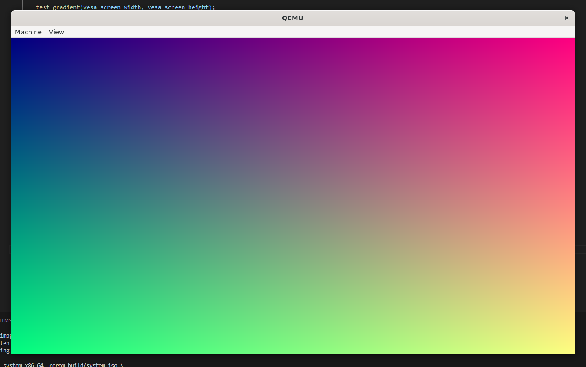
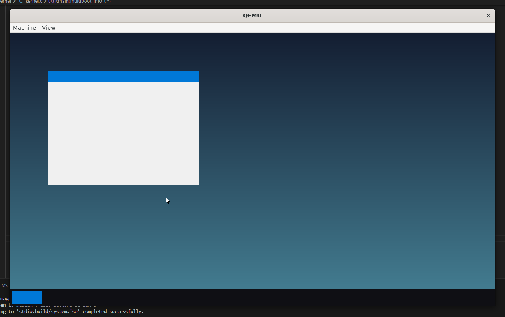

# VertexOS
*A high-precision, TUI-centric 32-bit x86 Operating System.*

VertexOS is a modular, monolithic kernel designed for efficiency and a streamlined user experience. Inspired by modern terminal editors like Neovim, it features a fixed-layout terminal interface, a custom command shell, and direct hardware communication via the Multiboot standard.

## 🛠 Features
- UI: A Neovim-inspired Terminal User Interface with a protected status bar and scrolling "View" region.
- Modular Architecture: Organized into logical domains (drivers/, cpu/, ui/, kernel/).
- Command Shell: Robust input buffering with support for real-time backspacing and line tracking.
- Hardware Intelligence: Detects CPU vendor and calculates total RAM via Multiboot structures.
- Professional Formatting: 24-hour RTC clock with leading-zero padding.

## 📸 System Gallery
### Gradient Test
```C
void test_gradient(uint32_t width, uint32_t height) {
    for (uint32_t y = 0; y < height; y++) {
        for (uint32_t x = 0; x < width; x++) {
            // Map X to Red (0-255) and Y to Green (0-255)
            uint8_t r = (x * 255) / width;
            uint8_t g = (y * 255) / height;
            uint8_t b = 128;

            vesa_draw_pixel(x, y, RGB(r, g, b));
        }
    }
}
```

### Desktop Test
```C
void test_desktop(uint32_t width, uint32_t height) {
    // Draw a "Deep Space" background gradient
    for (uint32_t y = 0; y < height; y++) {
        uint8_t color_val = (y * 100) / height;
        vesa_draw_rect(0, y, width, 1, RGB(20 + (color_val / 2), 30 + color_val, 50 + color_val));
    }

    // Taskbar (Dark translucent style)
    vesa_draw_rect(0, height - 45, width, 45, RGB(15, 15, 20));

    // Start Button (Accent color)
    vesa_draw_rect(5, height - 40, 80, 35, RGB(0, 120, 215)); 

    // Draw a "Window" outline
    vesa_draw_rect(100, 100, 400, 300, RGB(240, 240, 240));
    vesa_draw_rect(100, 100, 400, 30, RGB(0, 120, 215));
}
```



## 🚀 Getting Started
At this moment the only supported system for building is **Linux**. If you are using **Windows** i recommend downloading **Windows Subsystem for Linux (WSL)**
1. Install all requirements:
```Bash
sudo apt update && sudo apt install -y nasm make gcc-multilib binutils qemu-system-x86 grub-common grub-pc-bin xorriso mtools
```

2. Clone the project:
```Bash
git clone https://github.com/Bartus131313/VertexOS.git
cd VertexOS
```
3. Compile and Run:
```Bash
make run
```

## 📜 Commands
- `help` - List available system functions.
- `datetime` - Displays the current date and system time (UTC+1).
- `meminfo` - Queries the Multiboot header for hardware RAM specs.
- `cpu` - Prints the processor's vendor identity.
- `clear` - Resets the terminal buffer.

## ⚖️ License
This project is licensed under the MIT License. You are free to use, modify, and distribute this software, provided that the original copyright notice and permission notice are included.